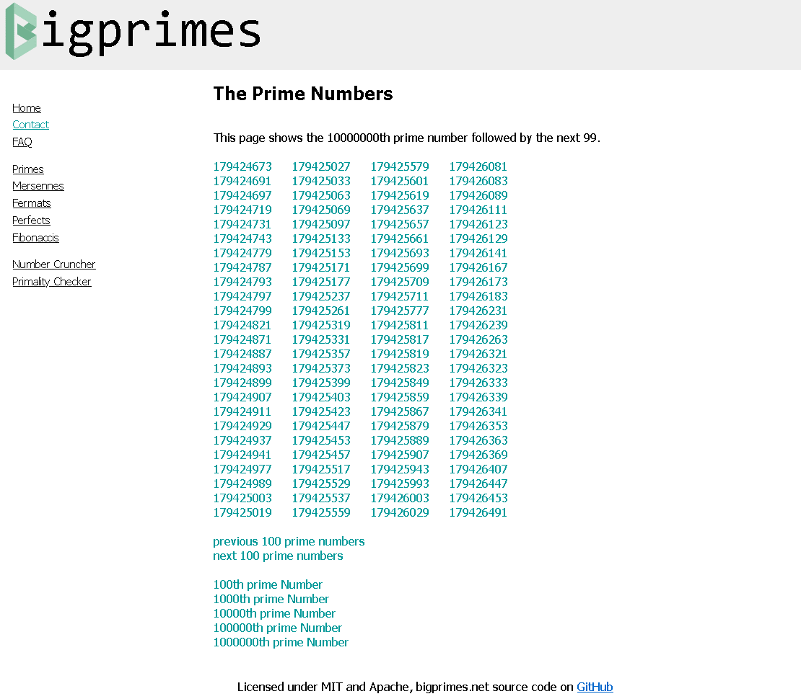

# bigprimes.net

A single page web app, written exclusively in rust and compiled to WebAssembly.

### Design patterns
BigPrimes uses the [Seed](https://github.com/seed-rs/seed) framework. Seed is inspired by [Elm](https://en.wikipedia.org/wiki/Elm_(programming_language)) and so uses the model-view-update (MVU) architecture.

## Contributing
Contributions are very welcome in the form of PRs. If it's a big contribution I recommend contacting me first and we can make sure it's aligned to the project direction. 
 1. Write code
 2. Run tests `cargo test` and check nothing is broken
 3. Add/run benchmarks `cargo bench` and check nothing is terribly slow
 4. `cargo fmt --all` to format code contributions.
 5. Create PR

### Setup your local dev environment
 1. Clone bigprimes.net `git clone https://github.com/craigmayhew/bigprimes.net.git`
 2. Install cargo rustc, rustup `curl https://sh.rustup.rs -sSf | sh`
 3. Add ability to compile to webassembly `rustup target add wasm32-unknown-unknown`
 4. Install wasm-pack `curl https://rustwasm.github.io/wasm-pack/installer/init.sh -sSf | sh`
 5. `cargo +stable install --locked trunk`
 6. `cargo install wasm-bindgen-cli`
 7. Build `trunk build`
 8. Build, serve and rebuild on changes `trunk serve --open`

### Build
 - Build: `wasm-pack build` or `trunk build`
 - Build and serve locally: `trunk serve --open`

## Thanks
 - https://seed-rs.org/
 - https://github.com/thedodd/trunk
